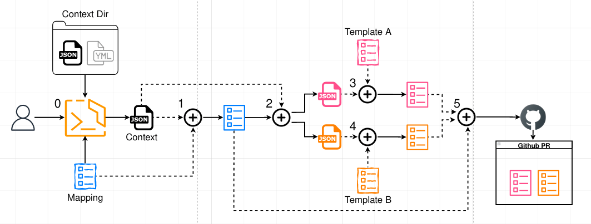

# templator

Template your files

This a tool/library born from the necessity of templating multiple files and pushing them in multiple locations.

# Quick start

```bash
npm i -g @gitops-toolbox/templator
tp
```

Head over to [templator-examples](https://github.com/gitops-toolbox/templator-examples) to try the tool

# From source code

```
git clone https://github.com/gitops-toolbox/templator
cd templator
npm i
```

## List templates

```
> ./bin/cli.js -b examples list templates # listTemplates
[
  "context.js",
  "context.njk"
]
```

## list mappings

```
> ./bin/cli.js -b examples list mappings # listMappings
[
  "example.js",
  "example.json",
  "readme.json",
  "nested/example.njk"
]
```

## Show context

### Full context

```
> ./bin/cli.js -b examples context # showContext
{
  "dev": {
    "environment": "development",
    "components": {
      "application": {
        "name": "templator"
      },
      "database": {
        "name": "Database"
      }
    }
  },
  "prd": {
    "environment": "production",
    "components": {
      "database": {
        "name": "Database"
      }
    }
  }
}
```

### Full context in yaml format

```
> ./bin/cli.js -b examples -o yaml context # showYamlContext
dev:
  environment: development
  components:
    application:
      name: templator
    database:
      name: Database
prd:
  environment: production
  components:
    database:
      name: Database

```

### Select a part of the context

```
> ./bin/cli.js -b examples context dev.components.application # showContextSelector
{
  "name": "templator"
}
```

### Select a part of the context via json

```
> ./bin/cli.js -b examples context '["dev", "components", "application"]' # showContextSelectorJson
{
  "name": "templator"
}
```

## Render just a mapping

```
> ./bin/cli.js -b examples generate --just-mapping nested/example.njk dev # renderMapping
{
  "mapping": {
    "locations": [
      {
        "template": "context.njk",
        "contextSelector": "components.application",
        "destination": {
          "type": "echo",
          "params": {
            "repo": "myorg/development",
            "filepath": "application.json"
          }
        },
        "tags": {
          "type": "application"
        },
        "templateData": {
          "context": {
            "name": "templator"
          },
          "meta": {
            "__mapping": "mappings/nested/example.njk",
            "__template": "templates/context.njk"
          }
        }
      },
      {
        "template": "context.js",
        "contextSelector": "components.database",
        "destination": {
          "type": "echo",
          "params": {
            "repo": "myorg/development",
            "filepath": "database.json"
          }
        },
        "tags": {
          "type": "database"
        },
        "templateData": {
          "context": {
            "name": "Database"
          },
          "meta": {
            "__mapping": "mappings/nested/example.njk",
            "__template": "templates/context.js"
          }
        }
      }
    ]
  },
  "context": {
    "environment": "development",
    "components": {
      "application": {
        "name": "templator"
      },
      "database": {
        "name": "Database"
      }
    }
  }
}
```

## Render in yaml format

```
> ./bin/cli.js -b examples generate -o yaml nested/example.njk dev # renderTemplate
locations:
  - template: context.njk
    contextSelector: components.application
    destination:
      type: echo
      params:
        repo: myorg/development
        filepath: application.json
    tags:
      type: application
    templateData:
      context:
        name: templator
      meta:
        __mapping: mappings/nested/example.njk
        __template: templates/context.njk
    renderedTemplate: |
      # Template file templates/context.njk
      # Mapping file mappings/nested/example.njk

      {"name":"templator"}
  - template: context.js
    contextSelector: components.database
    destination:
      type: echo
      params:
        repo: myorg/development
        filepath: database.json
    tags:
      type: database
    templateData:
      context:
        name: Database
      meta:
        __mapping: mappings/nested/example.njk
        __template: templates/context.js
    renderedTemplate: |
      # Template file templates/context.js
      # Mapping file mappings/nested/example.njk

      {"name":"Database"}

```

## Render in human readable format

```
> ./bin/cli.js -b examples generate nested/example.njk dev -h # renderHumanReadable
---
{"destination":{"type":"echo","params":{"repo":"myorg/development","filepath":"application.json"}},"tags":{"type":"application"}}
---
# Template file templates/context.njk
# Mapping file mappings/nested/example.njk

{"name":"templator"}

---
{"destination":{"type":"echo","params":{"repo":"myorg/development","filepath":"database.json"}},"tags":{"type":"database"}}
---
# Template file templates/context.js
# Mapping file mappings/nested/example.njk

{"name":"Database"}

```

## Render one file in human readable

```
> ./bin/cli.js -b examples generate nested/example.njk dev -h --filter-by '{"type": "database"}' # renderHumanReadableFilterBy
---
{"destination":{"type":"echo","params":{"repo":"myorg/development","filepath":"database.json"}},"tags":{"type":"database"}}
---
# Template file templates/context.js
# Mapping file mappings/nested/example.njk

{"name":"Database"}

```

## Render human readable limit to one file and hide header

```
> ./bin/cli.js -b examples generate nested/example.njk dev -h --filter-by '{"type": "database"}' --hide-headers # renderFileContent
# Template file templates/context.js
# Mapping file mappings/nested/example.njk

{"name":"Database"}

```

## Persist the result using the destination type of each template

```
./bin/cli.js -b examples generate nested/example.njk dev --persist # persist
{
  "echo": {
    "templates": [
      {
        "template": "context.njk",
        "contextSelector": "components.application",
        "destination": {
          "type": "echo",
          "params": {
            "repo": "myorg/development",
            "filepath": "application.json"
          }
        },
        "tags": {
          "type": "application"
        },
        "templateData": {
          "context": {
            "name": "templator"
          },
          "meta": {
            "__mapping": "mappings/nested/example.njk",
            "__template": "templates/context.njk"
          }
        },
        "renderedTemplate": "# Template file templates/context.njk\n# Mapping file mappings/nested/example.njk\n\n{\"name\":\"templator\"}\n"
      },
      {
        "template": "context.js",
        "contextSelector": "components.database",
        "destination": {
          "type": "echo",
          "params": {
            "repo": "myorg/development",
            "filepath": "database.json"
          }
        },
        "tags": {
          "type": "database"
        },
        "templateData": {
          "context": {
            "name": "Database"
          },
          "meta": {
            "__mapping": "mappings/nested/example.njk",
            "__template": "templates/context.js"
          }
        },
        "renderedTemplate": "# Template file templates/context.js\n# Mapping file mappings/nested/example.njk\n\n{\"name\":\"Database\"}\n"
      }
    ]
  }
}
```

## Persist the result grouping by a tag

```
./bin/cli.js -b examples generate nested/example.njk dev --persist --group-by type # groupBy
{
  "echo": {
    "application": {
      "templates": [
        {
          "template": "context.njk",
          "contextSelector": "components.application",
          "destination": {
            "type": "echo",
            "params": {
              "repo": "myorg/development",
              "filepath": "application.json"
            }
          },
          "tags": {
            "type": "application"
          },
          "templateData": {
            "context": {
              "name": "templator"
            },
            "meta": {
              "__mapping": "mappings/nested/example.njk",
              "__template": "templates/context.njk"
            }
          },
          "renderedTemplate": "# Template file templates/context.njk\n# Mapping file mappings/nested/example.njk\n\n{\"name\":\"templator\"}\n",
          "group": "application"
        }
      ]
    },
    "database": {
      "templates": [
        {
          "template": "context.js",
          "contextSelector": "components.database",
          "destination": {
            "type": "echo",
            "params": {
              "repo": "myorg/development",
              "filepath": "database.json"
            }
          },
          "tags": {
            "type": "database"
          },
          "templateData": {
            "context": {
              "name": "Database"
            },
            "meta": {
              "__mapping": "mappings/nested/example.njk",
              "__template": "templates/context.js"
            }
          },
          "renderedTemplate": "# Template file templates/context.js\n# Mapping file mappings/nested/example.njk\n\n{\"name\":\"Database\"}\n",
          "group": "database"
        }
      ]
    }
  }
}
```

## Create a new mapping

```
./bin/cli.js new mapping.njk # createNjkMapping
{# You can access the context with 'this' #}
{# the output should be a valid json #}

{
  "locations": [
    {
      "template": "{{ TEMPLATE }}",
      "contextSelector": "PATH.TO.{{ this.CONTEXT }}",
      "destination": {
        "type": "{{ destination }}",
        "params": {
          "repo": "{{this.ORG}}/{{this.REPO}}",
          "filepath": "PATH_ON_REPO"
        }
      },
      "tags": {
        "KEY1": "VALUE1",
        "KEY2": "VALUE2"
      }
    }
  ]
}

```

## Show help

```
> ./bin/cli.js --help # showHelp
cli.js <command>

Commands:
  cli.js context [context-selector]             Output the full context
  cli.js generate <mapping> [context-selector]  Output the rendered templates
  cli.js list <target>                          List one between templates and mappings
  cli.js new <mapping>                          Output a template for the selected mapping

Options:
      --help           Show help  [boolean]
      --version        Show version number  [boolean]
  -b, --base-dir       path where to find the config  [string] [default: "."]
      --context-dir    directory name of the context folder  [string] [default: "context"]
      --mappings-dir   directory where to search for mappings  [string] [default: "mappings"]
      --templates-dir  directory where to find the templates  [string] [default: "templates"]
```

# The flow



0. run `tp generate <mapping> [context-selector]`
1. interpolates _Mapping_ and the _selected context_ to generate a __rendered mapping__
2. Interpolates  __rendered mapping__ with the _selected context_ to get a contexts for each templates
3. Interpolates _Template A_ with its context to get __rendered Template A__
4. Interpolates _Template B_ with its context to get __rendered Template B__
5. Using the destinations in __rendered mapping__ and __rendered Template A__ and __rendered Template B__ generates a github PR

I know it is confusing, you might want to check out the examples


# Terminology

## Context

The data folder (default to `context`) should only contain folders and `json` files.

The data will be merged as for the logic in the `config-loader` library.

## Mappings

The mappings folder (default to `mappings`) can contain `.json` or `.njk` or `.js` mapping files.

Each mapping files should return a valid object or json with the following content:

```
{
  "locations": [
    {
      "template": "<template-path>",
      "contextSelector": "<context-selector>",
      "tags": {"tagName": "tagValue"},          # Optional
      "destination": { "type": "<destination-type>", ... }
    }
  ]
}
```

## Templates

The templates folder (default to `templates`).
The templates will be rendered by the mappings using [Nunjucks](nunjucks).
